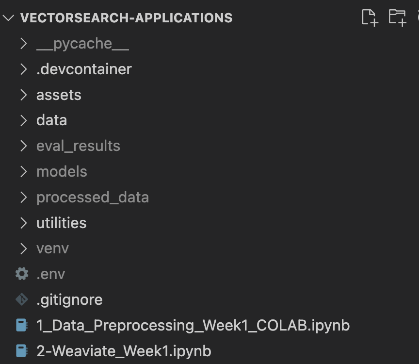

So I tried to be fancy in some instances and now that I'm just about to turn in my project I relized that will cause issues for you...

therefore I'm including two things.
1. My weaviate api_key and url which I will delete on Tuesday. This is needed because I decided to be (not so) clever and do some topic modelling to give each episode a topic tag which I included in my index. This is needed for my filtering setup.
The info will be in the project submission
2. I'm also including a link to a google drive folder with my models and my processed_data because I'm not sure how else you will be able to run my application. These folders should be positioned as shown in the image:

I sincerely apologize for this inconveniance!